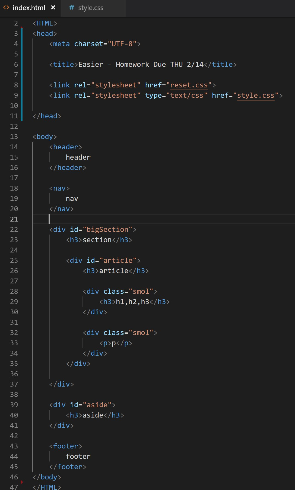
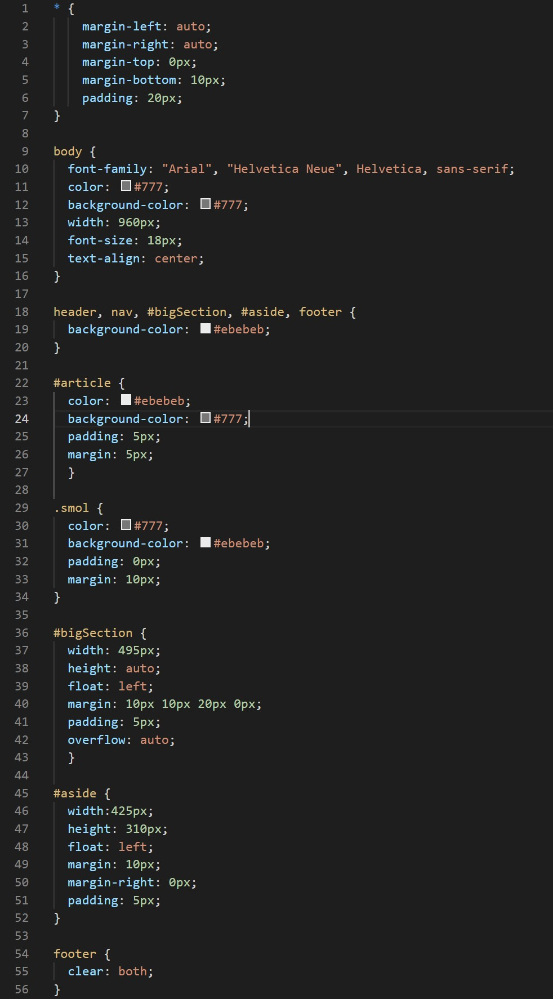
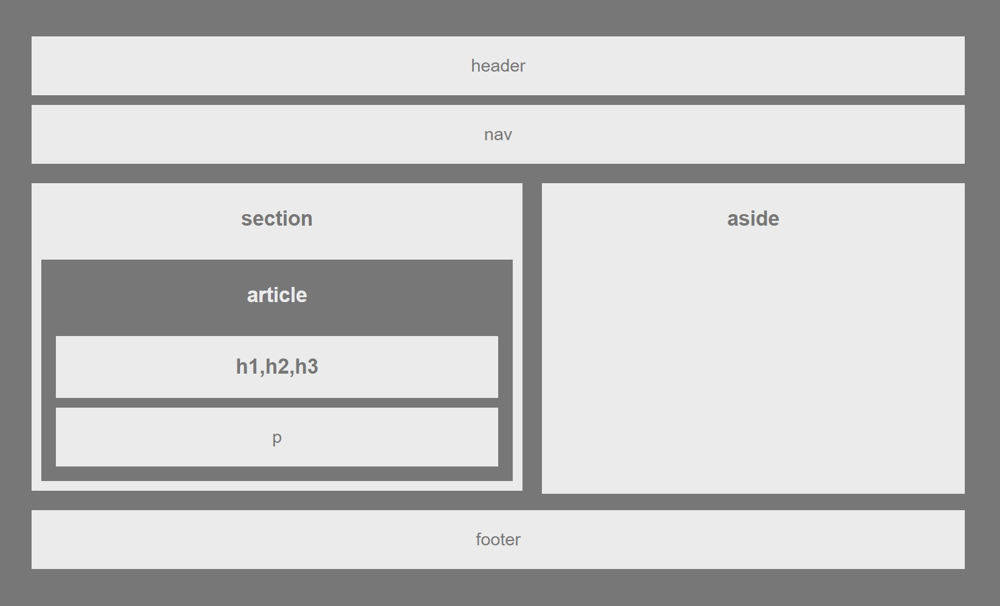

# Easier Homework - Building a Wireframe

  * ## Project Description
    
    For this project, I had to creat a "web design skeleton" using HTML/CSS, following certain specifications.
  
  * ## Technologies Used

    I used HTML/CSS for this project. For HTML, I fulfilled the specifications requirement by using section tags such as &lt;header&gt;, &lt;nav&gt;, &lt;div&gt;, and &lt;footer&gt;.

    In order to stylize them in CSS, I also assigned "class" and "id" tags to my &lt;div&gt; tags as well.

  * ## Screenshots of Essential Code
    * HTML Below
    
    
    * CSS Below
    
        
  * ## Gif Walkthrough of App Functioning 
    
    This is a static webpage so it does not have an animated gif.

    
